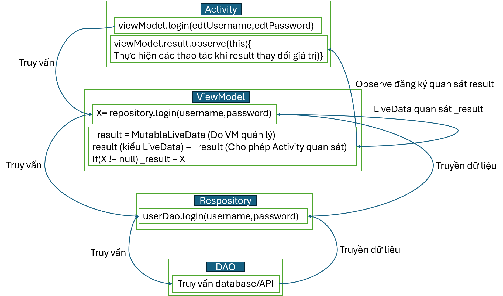

# Mô hình MVVM trong Android

## 1. Mô hình MVVM là gì?

**MVVM (Model - View - ViewModel)** là mô hình kiến trúc được Google khuyến nghị sử dụng trong Android nhằm tách biệt giao diện với logic xử lý dữ liệu.

### Các thành phần

#### View (Activity/Fragment)

Là phần giao diện người dùng:

- Hiển thị dữ liệu.
- Nhận thao tác từ người dùng.
- Quan sát dữ liệu từ ViewModel.

#### ViewModel

Là cầu nối giữa View và dữ liệu.
Nhiệm vụ:

- Chứa logic nghiệp vụ.
- Gọi Repository lấy dữ liệu.
- Quản lý trạng thái màn hình.
- Cung cấp dữ liệu cho View thông qua LiveData.

#### Model

Là tầng dữ liệu, bao gồm:

- Repository
- Room Database
- API
- Firebase
- Cache

Nhiệm vụ:

- Lưu trữ dữ liệu.
- Truy xuất dữ liệu.

---

### Kiến trúc MVVM

```
e:\Android\mvvm.png

## 2. So sánh MVVM với MVC và MVP

### MVC (Model - View - Controller)
```

View
↕
Controller
↕
Model

```
* **Ưu điểm:**
  - Dễ học.
  - Dễ triển khai với dự án nhỏ.
* **Nhược điểm:**
  Controller thường phải xử lý UI, xử lý logic và lấy dữ liệu. Dẫn đến Controller rất lớn, khó bảo trì và khó test.

### MVP (Model - View - Presenter)
```

View
↕
Presenter
↕
Model

```
* **Ưu điểm:**
  - Tách UI và logic tốt hơn MVC.
  - Dễ Unit Test.
* **Nhược điểm:**
  Presenter thường có quan hệ 1 View ↔ 1 Presenter. Dự án lớn sẽ có rất nhiều Presenter và Presenter dễ trở nên cồng kềnh.

### MVVM (Model - View - ViewModel)
```

View
↓ observe
ViewModel
↓
Repository
↓
Model

```
* **Ưu điểm:**
  - Tách biệt rõ trách nhiệm.
  - Dễ bảo trì và dễ mở rộng.
  - Dễ Unit Test.
  - Tích hợp tốt với LiveData, StateFlow, Room.
  - Được Google hỗ trợ chính thức.
* **Nhược điểm:**
  - Khó hiểu hơn MVC với người mới học.
  - Nhiều lớp (class) hơn.

---

Hiện nay phần lớn dự án Android hiện đại đều sử dụng: **MVVM + Repository + Room + LiveData/StateFlow**.

---

## 3. LiveData là gì? Tại sao dùng LiveData giữa View và ViewModel?

### LiveData là gì?
**LiveData** là một thành phần của Android Jetpack dùng để **lưu dữ liệu** và **thông báo khi dữ liệu thay đổi**.

Nó hoạt động theo cơ chế **Observable Data Holder**, nghĩa là:
```

Có dữ liệu ──> Dữ liệu thay đổi ──> Tự động thông báo cho View

```

### Cách hoạt động
```

ViewModel
│
│ cập nhật dữ liệu
▼
LiveData
│
│ thông báo
▼
Activity / Fragment

```

### Vì sao không dùng biến thông thường?
* **Biến thường:** Khi ViewModel thay đổi dữ liệu, Activity không hề biết để cập nhật giao diện.
* **LiveData:** Khi ViewModel thay đổi dữ liệu, LiveData phát hiện, tự động thông báo và Activity nhận được thông báo để tự động cập nhật UI.

### Ưu điểm của LiveData
1. **Tự động cập nhật UI:** Dữ liệu đổi -> UI đổi theo.
2. **Lifecycle Aware:** LiveData nhận biết được vòng đời (Lifecycle) của View (Activity/Fragment đang hoạt động hay đã bị hủy). Nếu màn hình bị đóng (Destroyed), LiveData sẽ tự hủy đăng ký để tránh **Memory Leak** và **Crash**.
3. **Đúng tinh thần MVVM:** ViewModel chỉ cung cấp dữ liệu, View chỉ hiển thị dữ liệu. Hai thành phần không phụ thuộc trực tiếp vào nhau.

### Vai trò của LiveData trong MVVM
```

View <─── (observe) ─── LiveData <─── (update) ─── ViewModel

```
LiveData chính là cầu nối dữ liệu an toàn và linh hoạt giữa View và ViewModel.

---

## 4. Luồng hoạt động (Data Flow) của chức năng Đăng Nhập

### Luồng yêu cầu (Request Flow)
Người dùng nhập **Username**, **Password** và nhấn nút **Login**.

```


